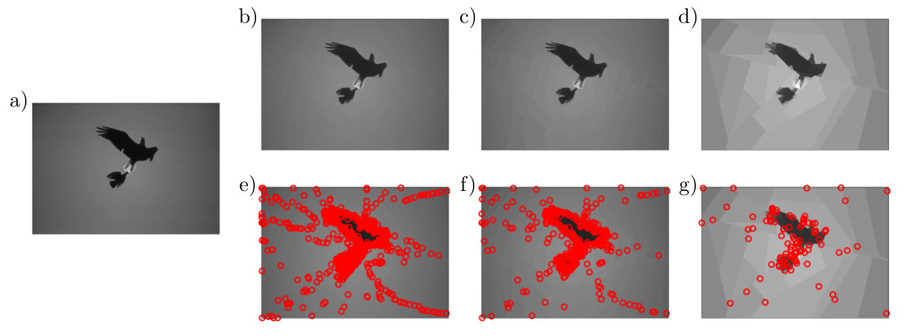
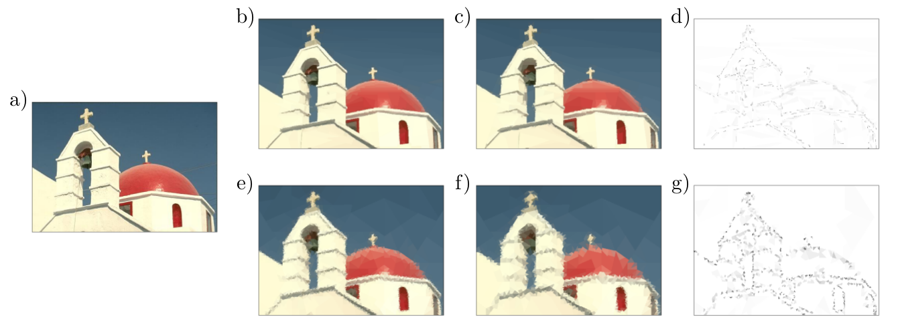

# Graph Wedgelets for Image Compression

A simple toolbox to illustrate how graph wedgelets can be used to sparsely approximate and compress images 
--------------------------------------------------------------------------------

 
Fig. 1: Wedgelet compression of images. a) original image with 481 x 321 pixels; 
	 b)c)d) BWP compression with 1000, 500 and 100 graph wedgelets; 
	 e)f)g) center nodes for BWP encoding in b)c)d). 
	 The PSNR values are b) 40.762 dB, c) 37.935 dB, and d) 31.827 dB. 

Version: 0.1 (01.10.2021)

Written by <a href="http://www.lissajous.it"> Wolfgang Erb</a>

General Description
-------------------

This package contains a Matlab implementation for the illustration of graph-based wedgelets in image approximation and compression. 

<a href="http://www.lissajous.it/wedgelets.html"> Graph wedgelets</a> are a tool for lossy data compression based 
on the approximation of graph signals by piecewise constant functions on adaptively generated binary wedge partitioning trees (BWP trees) of a graph. Graph wedgelets are discrete variants of continuous wedgelets and binary space partitionings known from image processing. Wedgelet representations of graph signals can be encoded in a simple way by a set of graph nodes and applied easily to the compression of graph signals and images. A detailed description of the encoding and decoding of graph signals with wedgelets is given in [1]. 

 

 
Fig. 2: Wedgelet compression of images. a) original image with 481 x 321 pixels; b)c) FA-greedy BWP compression with 2000 and 1000 nodes; d) wavelet details between b) and c); e)f) MD-greedy BWP compression with 2000 and 1000 nodes; g) wavelet details between e) and f).

 

Description of the Code
-----------------------

The package contains three main parts

- The main folder contains three example scripts on how to use the different tools of the package. 

- The subfolder *./core* contains the core code of the package for wedgelet encoding and decoding of images. 

- The subfolder *./data* contains two example images

Remarks
--------------------

This code is written for educational purposes and is not optimized for speed nor for optimal image storage. 

Citation and Credits
--------------------

This code was written by Wolfgang Erb at the Dipartimento di Matematica ''Tullio Levi-Civita'', University of Padova. The corresponding theory related to graph wedgelets and data compression can be found in

*   [1] &nbsp; Erb, W.  
    <i> Graph Wedgelets: Adaptive Data Compression on Graphs based on Binary
    Wedge Partitioning Trees and Geometric Wavelets. </i> 
    arXiv:2110.08843  [eess.SP] (2021) 

Source for the two original images: Berkeley Segmentation Data Set and Benchmarks 500 (BSDS500)

 

License
-------

Copyright (C) 2021 Wolfgang Erb

**GraphWedgelets** is free software: you can redistribute it and/or modify
it under the terms of the GNU General Public License as published by
the Free Software Foundation, either version 3 of the License, or
(at your option) any later version.

This program is distributed in the hope that it will be useful,
but WITHOUT ANY WARRANTY; without even the implied warranty of
MERCHANTABILITY or FITNESS FOR A PARTICULAR PURPOSE.  See the
GNU General Public License for more details.

You should have received a copy of the GNU General Public License
along with this program. If not, see <http://www.gnu.org/licenses/>.